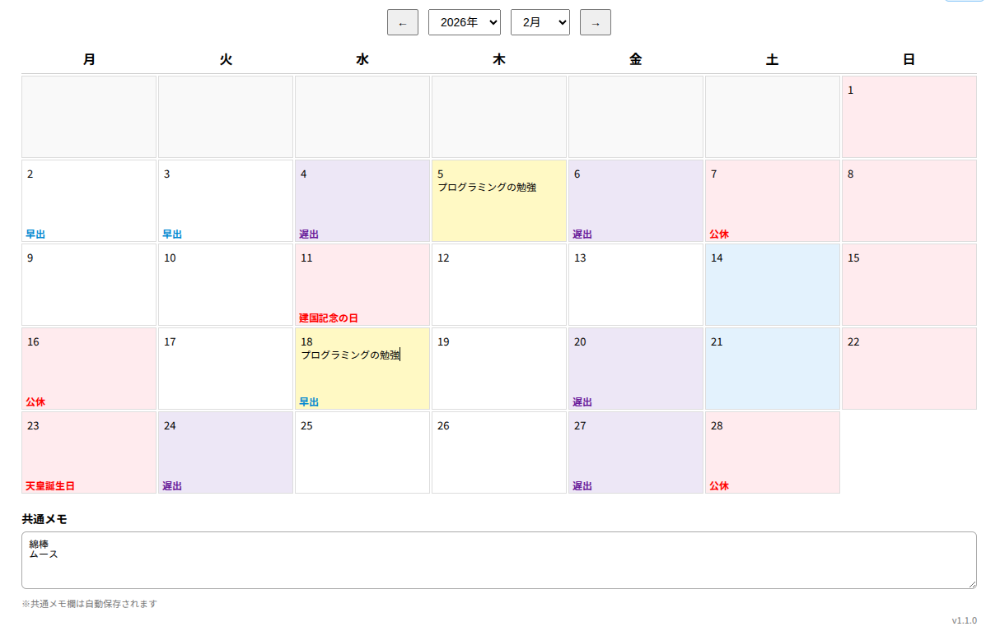
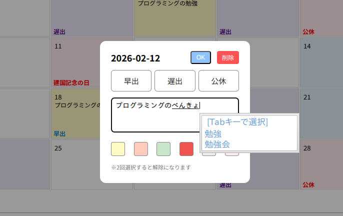
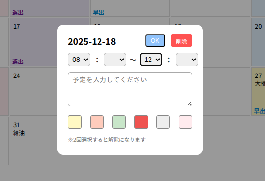
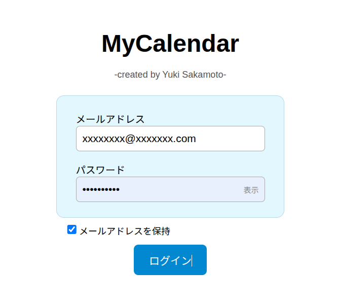

# 年末年始につくったcalendar-app

- 公開リンク：https://calendar-app-ten-steel.vercel.app/
  - 練習用メールアドレス：test@sample.com
  - 練習用パスワード：testsample

## 概要
Javascript初心者がCopilotをフル活用してつくったReact+Vercel+Supabaseのフルスタックアプリです。
時間帯指定などをせず、手帳に手書きをするような、手間がないシンプルなカレンダーアプリです。

## 主な機能
- 早出、遅出、公休のシンプルな構成で、その下にメモを残す仕様
  
- 設定から時間シフト制（例：10-17）などの登録も可能
    
- 祝日は自動で取得し、祝日名も表示

## 技術ポイント
- Reactによる軽快な操作性の実現
- Supabase+vercelの活用によってデータベースを保存
- ログイン画面の実装によって個人別の予定を表示
    

## 今後の展望
- アレクサ連携で予定の通知
- LINEで予定の通知
